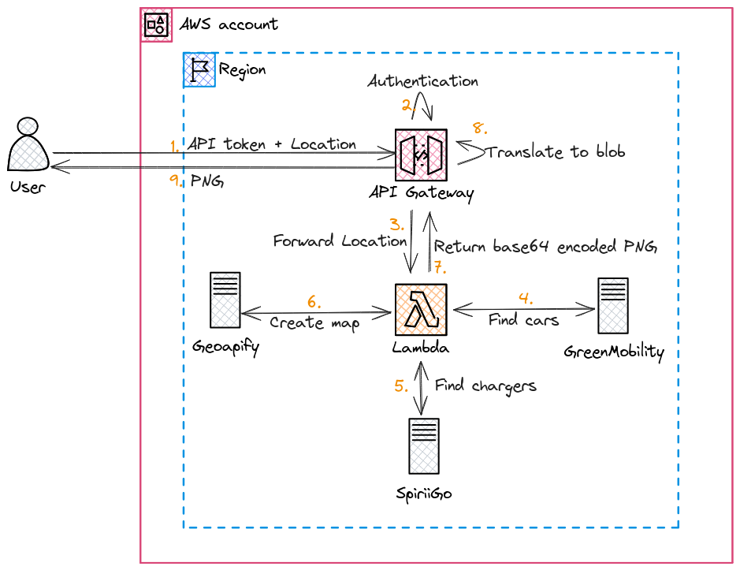

# GreenMo Stalker

[](https://github.com/Cupprum/greenmo-stalker/actions/workflows/deploy.yml)

API proxy for identifying Greenmobility vehicles requiring charging in proximity to available Spirii charging stations. Returns a static map image with vehicle and charger locations.

## Architecture



The system consists of an AWS Lambda function (Go) fronted by API Gateway. It interacts with:
- **Greenmobility API**: Fetches vehicle locations and battery levels.
- **Spirii API**: Fetches charging station availability.
- **Geoapify Static Maps API**: Generates the visualization.

## Configuration

Environment variables are managed via `.env`:

- `GREENMO_AWS_REGION`: Target AWS region.
- `GREENMO_OPEN_MAPS_API_TOKEN`: Geoapify API key.

Optional Environment variables used for local testing:
- `GREENMO_API_URL`: Deployed API Gateway endpoint.
- `GREENMO_API_KEY`: API Gateway x-api-key for authentication.

## Development and Testing

Use `run.sh` for local operations:

### Execute Tests
Runs the Go test suite with mock servers for external dependencies.
```bash
./run.sh test
```

### Run Locally
Executes the function logic locally.
```bash
./run.sh run
```

### Trigger Remote API
Sends a test request to the deployed production endpoint.
```bash
./run.sh trigger
```

## Deployment

Deployment is managed via AWS SAM. Ensure AWS credentials are configured in the environment.

### Build and Deploy
The `deploy.sh` script automates the SAM build and deployment process:
```bash
./deploy.sh
```

This script:
1. Builds the Go binary using a containerized environment.
2. Deploys the CloudFormation stack `greenmo-stalker-stack`.
3. Overrides parameters for the Map API token and API Key using values from `.env`.
